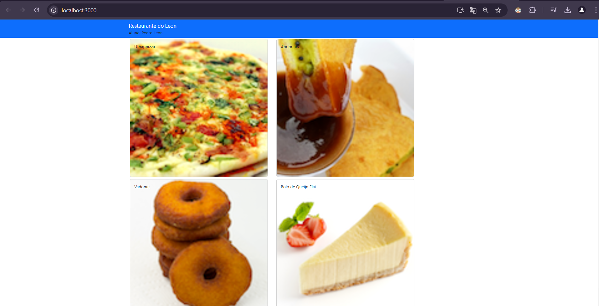

### UC13 - Executar os Processos de Codificação, Manutenção e Documentação de Aplicativos Computacionais para Desktop

## Exercícios - Aula 09

### Objetivo
Este documento detalha os exercícios da Aula 09, onde aprendemos a adicionar um novo componente ao aplicativo React, incorporarando dados a esse componente e atualizando o aplicativo para exibir sobre informações sobre um restaurante na página da web.

---

## Exercício 1 - Adicionando Componentes ao Aplicativo React

```javascript
import React, { useState } from 'react'; // Importa React e o hook useState do React
import { Media } from 'reactstrap'; // Importa o componente Media do Reactstrap

// Define o componente funcional Menu
const Menu = () => {
  // Define o estado inicial com uma lista de pratos usando o hook useState
  const [dishes] = useState([
    {
      id: 0,
      name: 'Uthappizza',
      image: 'assets/images/uthappizza.png',
      category: 'mains',
      label: 'Hot',
      price: '4.99',
      description: 'A unique combination of Indian Uthappam (pancake) and Italian pizza, topped with Cerignola olives, ripe vine cherry tomatoes, Vidalia onion, Guntur chillies and Buffalo Paneer.'
    },
    {
      id: 1,
      name: 'Zucchipakoda',
      image: 'assets/images/zucchipakoda.png',
      category: 'appetizer',
      label: '',
      price: '1.99',
      description: 'Deep fried Zucchini coated with mildly spiced Chickpea flour batter accompanied with a sweet-tangy tamarind sauce'
    },
    {
      id: 2,
      name: 'Vadonut',
      image: 'assets/images/vadonut.png',
      category: 'appetizer',
      label: 'New',
      price: '1.99',
      description: 'A quintessential ConFusion experience, is it a vada or is it a donut?'
    },
    {
      id: 3,
      name: 'ElaiCheese Cake',
      image: 'assets/images/elaicheesecake.png',
      category: 'dessert',
      label: '',
      price: '2.99',
      description: 'A delectable, semi-sweet New York Style Cheese Cake, with Graham cracker crust and spiced with Indian cardamoms'
    }
  ]);

  // Mapeia a lista de pratos para criar elementos JSX para cada prato
  const menu = dishes.map((dish) => {
    return (
      <div key={dish.id} className="col-12 mt-5">
        <Media tag="li">
          <Media left middle>
            <Media object src={dish.image} alt={dish.name} /> {/* Exibe a imagem do prato */}
          </Media>
          <Media body className="ml-5">
            <Media heading>{dish.name}</Media> {/* Exibe o nome do prato */}
            <p>{dish.description}</p> {/* Exibe a descrição do prato */}
          </Media>
        </Media>
      </div>
    );
  });

  // Retorna o JSX que representa o menu
  return (
    <div className="container">
      <div className="row">
        <Media list>
          {menu} {/* Renderiza a lista de pratos */}
        </Media>
      </div>
    </div>
  );
};

export default Menu; // Exporta o componente Menu como padrão
```

### Explicação do Código

1. **Importações:**
   - `React` e `useState` são importados do pacote `react`. `useState` é um hook que permite adicionar o estado ao componente funcional.
   - `Media` é importado do `reactstrap`, uma biblioteca de componentes React baseada no Bootstrap.

2. **Definição do Componente `Menu`:**
   - O componente `Menu` é definido como uma função que utiliza o hook `useState` para armazenar uma lista de pratos (`dishes`).
   - A lista de pratos (`dishes`) é inicializada com um array de objetos, onde cada objeto representa um prato com propriedades como `id`, `name`, `image`, `category`, `label`, `price` e `description`.

3. **Mapeamento dos Pratos:**
   - A função `map` é usada para iterar sobre a lista de pratos e retornar um elemento JSX para cada prato.
   - Cada prato é renderizado dentro de um `div` com classes Bootstrap para layout (`col-12 mt-5`).
   - O componente `Media` do `reactstrap` é usado para estruturar a exibição de cada prato, incluindo a imagem (`Media object`), o nome (`Media heading`) e a descrição (`p`).

4. **Renderização do Menu:**
   - O JSX retornado pelo componente `Menu` inclui um contêiner (`div` com classe `container`) e uma linha (`div` com classe `row`).
   - Dentro da linha, a lista de pratos (`menu`) é renderizada usando o componente `Media list`.

5. **Exportação do Componente:**
   - O componente `Menu` é exportado como padrão para que possa ser importado e usado em outros arquivos, como `App.js`.
   
###  Conclusão
   - Ao completar os exercícios da Aula 09, adquirimos habilidades essenciais para trabalhar com componentes em React. Aprendemos a adicionar um novo componente ao aplicativo, incorporar dados a esse componente e atualizar a interface do usuário. Este processo envolveu o uso de hooks como useState para gerenciar o estado e a biblioteca reactstrap para estilizar os componentes.

---
   
##### Aula 10 - Documentação dos Exercícios

#### Objetivo
Este documento detalha os exercícios da Aula 10, onde aprendemos a adicionar novos componentes ao aplicativo React, incorporar dados a esses componentes e atualizar o aplicativo para exibir informações sobre um restaurante na página da web.

---

## MenuComponent.js

### Breve Descrição
O arquivo `MenuComponent.js` é responsável por renderizar a lista de pratos disponíveis no menu de um restaurante. Ele permite que os usuários visualizem os pratos e selecionem um prato específico para ver mais detalhes.

### Imports Utilizados
- `import React, { useState } from 'react';`: Importa o React e o hook `useState` para gerenciar o estado do componente.
- `import { Card, CardImg, CardImgOverlay, CardText, CardBody, CardTitle } from 'reactstrap';`: Importa vários componentes do Reactstrap para criar cartões estilizados que exibem os pratos.

### Componentes
- **Componente Menu:**
  - É um componente funcional que recebe `props` como argumento.
  - Gerencia o estado do prato selecionado (`selectedDish`).
  - Renderiza uma lista de pratos usando cartões (`Card`).
  - Permite a seleção de um prato e exibe os detalhes do prato selecionado.

### Funções
- **Função `onDishSelect`:**
  - Atualiza o estado `selectedDish` com o prato que foi clicado.
  - Permite que o componente saiba qual prato foi selecionado, para que possa exibir seus detalhes.

- **Função `renderDish`:**
  - Verifica se um prato foi selecionado (`dish != null`).
  - Se um prato foi selecionado, renderiza um `Card` com a imagem, nome e descrição do prato.
  - Se nenhum prato foi selecionado, retorna um `div` vazio.
  - Serve para exibir os detalhes do prato selecionado de forma condicional.

- **`props.dishes.map`:**
  - Mapeia os pratos recebidos via `props.dishes` para criar uma lista de `Card` para cada prato.
  - Cada `Card` é clicável e chama a função `onDishSelect` ao ser clicado, permitindo a seleção do prato.
  - Serve para gerar dinamicamente a lista de pratos a partir dos dados fornecidos via `props`.

Essas funcionalidades tornam o componente `Menu` interativo e dinâmico, permitindo que os usuários explorem os pratos disponíveis e vejam mais detalhes sobre qualquer prato específico ao clicar nele.

---

## dishes.js

### Breve Descrição
O arquivo `dishes.js` serve para definir e exportar uma constante chamada `DISHES`, que é um array de objetos representando os pratos disponíveis no menu de um restaurante. Cada objeto no array contém informações detalhadas sobre um prato específico, incluindo seus comentários.

### Propriedades
Cada objeto no array `DISHES` possui as seguintes propriedades:
- `id`: Identificador único do prato.
- `name`: Nome do prato.
- `image`: Caminho para a imagem do prato.
- `category`: Categoria do prato (por exemplo, 'mains', 'appetizer', 'dessert').
- `label`: Rótulo do prato (pode ser usado para destacar algo especial, como "Hot" ou "New").
- `price`: Preço do prato.
- `description`: Descrição detalhada do prato.
- `comments`: Array de comentários sobre o prato, onde cada comentário é um objeto com as seguintes propriedades:
  - `id`: Identificador único do comentário.
  - `rating`: Avaliação do prato (de 1 a 5).
  - `comment`: Texto do comentário.
  - `author`: Autor do comentário.
  - `date`: Data do comentário.

### Tipo de Data Utilizado
O tipo de data utilizado para a propriedade `date` nos comentários é uma string no formato ISO 8601, que inclui a data e a hora. Por exemplo: "2012-10-16T17:57:28.556094Z". Este formato é amplamente utilizado para representar datas e horas de forma padronizada e facilita a manipulação e exibição das informações de data e hora em diferentes fusos horários e contextos.

---

## App.js

### Breve Descrição
O arquivo `App.js` é o ponto de entrada principal do aplicativo React. Ele configura a estrutura básica da aplicação, incluindo a barra de navegação e o componente de menu que exibe os pratos disponíveis. Este arquivo é essencial para inicializar o estado da aplicação e renderizar os componentes principais na interface do usuário.

### Funções e Componentes
- **`const [dishes] = useState(DISHES);`:**
  - Esta linha de código utiliza o hook `useState` do React para definir o estado inicial do componente `App`.
  - `useState(DISHES)` inicializa o estado `dishes` com os dados dos pratos importados da constante `DISHES`.
  - `dishes` é uma variável de estado que contém a lista de pratos e pode ser usada para passar esses dados para outros componentes.

- **`<Menu dishes={dishes} />`:**
  - Este JSX é responsável por renderizar o componente `Menu` e passar a lista de pratos (`dishes`) como uma propriedade (`props`).
  - `dishes={dishes}` significa que a propriedade `dishes` do componente `Menu` será preenchida com os dados armazenados na variável de estado `dishes`.
  - Dentro do componente `Menu`, os dados dos pratos podem ser acessados via `props.dishes`, permitindo que o componente `Menu` exiba a lista de pratos e interaja com esses dados conforme necessário.

### Resumo
O arquivo `App.js` configura a estrutura básica da aplicação, inicializa o estado com os dados dos pratos e renderiza a barra de navegação e o componente `Menu`. A variável de estado `dishes` armazena a lista de pratos, que é passada como propriedade para o componente `Menu`, permitindo que este exiba e interaja com os dados dos pratos.

---

